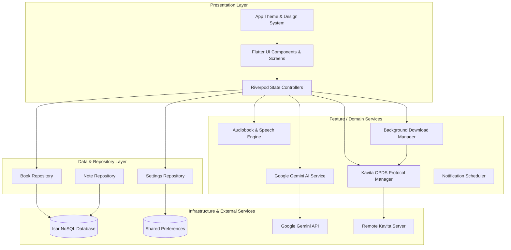
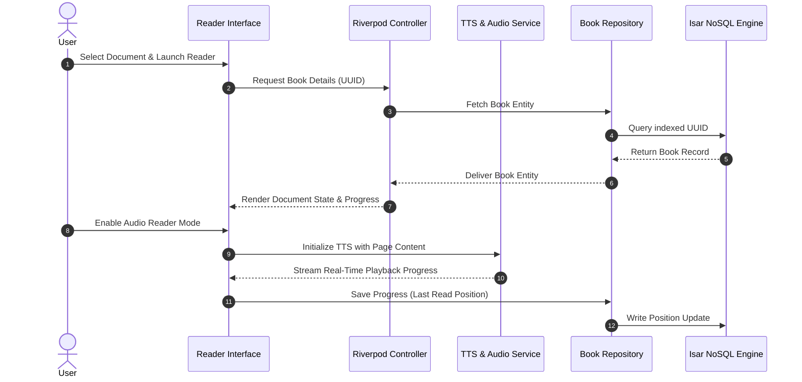
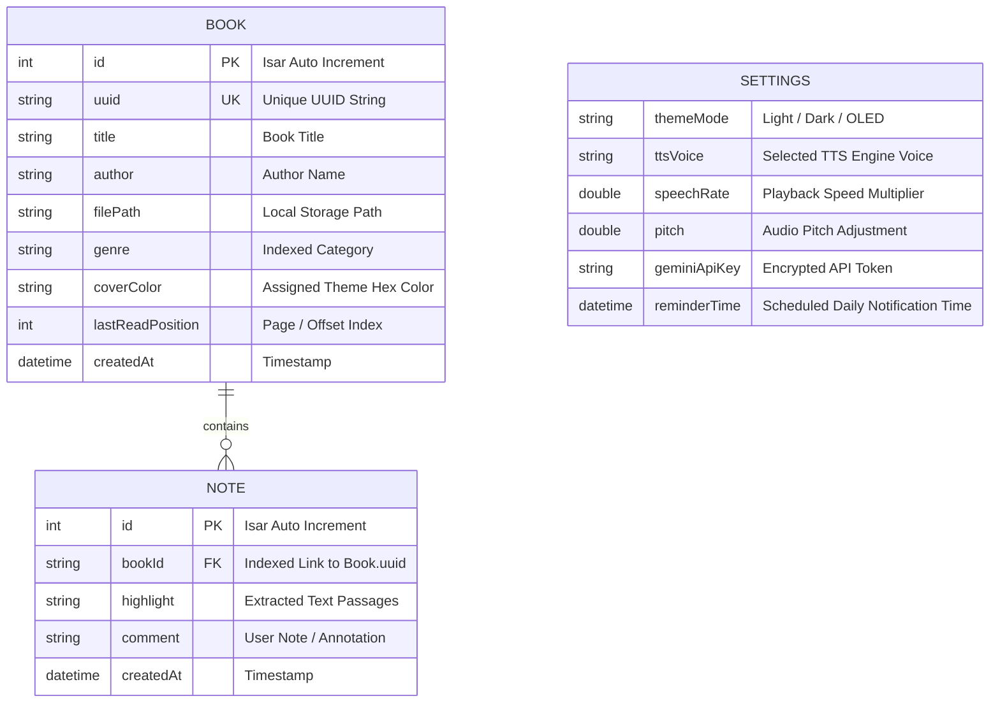

# Vellum

Vellum is a modern, high-performance digital book reader and audiobook ecosystem built using Flutter and Dart. Designed around Clean Architecture principles, Vellum unifies local document management, high-efficiency NoSQL persistence using Isar, reactive state management via Riverpod, and intelligent context processing powered by Google Gemini AI.

---

## Table of Contents

- [Overview](#overview)
- [Key Features](#key-features)
- [System Architecture](#system-architecture)
  - [Clean Architecture Overview](#clean-architecture-overview)
  - [State Management & Data Flow](#state-management--data-flow)
  - [Database Schema & Entity Relations](#database-schema--entity-relations)
- [Technology Stack](#technology-stack)
- [Project Directory Structure](#project-directory-structure)
- [Getting Started](#getting-started)
  - [Prerequisites](#prerequisites)
  - [Installation](#installation)
  - [Code Generation](#code-generation)
  - [Running the Application](#running-the-application)
- [Service Integrations](#service-integrations)
  - [Google Gemini AI](#google-gemini-ai)
  - [Kavita Server Synchronization](#kavita-server-synchronization)
  - [Text-to-Speech & Audio Engine](#text-to-speech--audio-engine)
- [License](#license)

---

## Overview

Vellum is designed to provide a distraction-free, visually dynamic, and feature-rich digital reading environment. The application supports PDF documents, structured book annotations, background audiobook playback, and OPDS server synchronization through Kavita integrations. Built-in generative AI capabilities allow readers to summarize text, query content, and analyze annotations seamlessly within their local library.

---

## Key Features

- **Document Reading Engine**: Seamless rendering of PDF files with custom reading themes (Cream Paper, Dark OLED Mode), position tracking, and page state retention.
- **Audiobook & Text-to-Speech Engine**: Integrated TTS and audio player supporting custom playback speeds, voice pitch selection, and background service execution via system media controls.
- **AI Reading Assistant**: Deep integration with Google Gemini AI for contextual text extraction, chapter summarization, and interactive document Q&A.
- **Kavita OPDS Integration**: Connect to personal Kavita servers to browse online catalogs, stream remote volumes, and manage background downloads.
- **NoSQL Persistence**: Ultra-fast local database operations powered by Isar Database with reactive UI streams and cascade deletion safety.
- **Annotations & Note Management**: Highlighting, note capture, and contextual search linked directly to individual book UUIDs.
- **Reading Reminders**: Local notification scheduling system for managing daily reading goals.

---

## System Architecture

### Clean Architecture Overview

Vellum follows Clean Architecture principles, isolating business logic, data models, state providers, and UI presentation components into decoupled modules.



---

### State Management & Data Flow

Application state is governed by Riverpod, delivering reactive updates from data repositories to presentation widgets via Rx-style streams.



---

### Database Schema & Entity Relations

Vellum uses Isar NoSQL for fast, indexed local persistence. The relational link between books and user notes is preserved through unique UUID keys.



---

## Technology Stack

- **Framework**: Flutter (SDK >= 3.2.0)
- **Programming Language**: Dart (SDK >= 3.10.4)
- **State Management**: Riverpod (`flutter_riverpod`, `riverpod_annotation`)
- **Local Persistence**: Isar Database (`isar`, `isar_flutter_libs`)
- **AI Processing**: Google Generative AI (`google_generative_ai`)
- **Document Rendering**: `flutter_pdfview`, `syncfusion_flutter_pdf`
- **Audio & TTS**: `just_audio`, `audio_service`, `flutter_tts`
- **Networking**: `http`, `path_provider`
- **Notifications**: `flutter_local_notifications`, `timezone`
- **UI & Typography**: Google Fonts (`Libre Baskerville`, `Lato`), Lucide Icons

---

## Project Directory Structure

```
lib/
├── core/
│   ├── services/
│   │   ├── ai_service.dart          # Google Gemini AI API integration
│   │   ├── audiobook_service.dart   # Text-to-speech and audio playback engine
│   │   ├── download_manager.dart    # Background book download coordinator
│   │   ├── kavita_service.dart      # OPDS server connection and authentication
│   │   ├── reminder_service.dart    # Local notification scheduling
│   │   └── storage_service.dart     # File system directory management
│   ├── theme/
│   │   ├── app_theme.dart           # Light/Dark OLED theme configurations
│   │   ├── colors.dart              # Earth-tone and functional palette definitions
│   │   └── theme_provider.dart      # Theme mode state provider
│   └── utils/
│       ├── color_utils.dart         # Cover color generation utilities
│       └── error_dialog.dart        # Unified error dialog UI components
├── features/
│   ├── data/
│   │   ├── models/
│   │   │   ├── book.dart            # Isar Book schema definition
│   │   │   └── note.dart            # Isar Note schema definition
│   │   └── repositories/
│   │       └── book_repository.dart # Book & Note CRUD logic
│   ├── library/
│   │   └── presentation/        # Library grid, details, and search screens
│   ├── notes/
│   │   └── presentation/        # Highlights and annotations reader view
│   ├── reader/
│   │   └── presentation/        # PDF view engine and reading overlay
│   └── settings/
│       ├── data/                    # User settings repository
│       └── presentation/            # Preferences and configuration UI
└── main.dart                        # Application startup entry point
```

---

## Getting Started

### Prerequisites

Ensure your environment satisfies the following development tools:

- Flutter SDK version 3.2.0 or higher
- Dart SDK version 3.10.4 or higher
- Android Studio / VS Code with Flutter extensions
- Android SDK (API 21 minimum) or iOS development environment

### Installation

1. Clone the project repository:
   ```bash
   git clone https://github.com/Carbon-7/Vellum.git
   ```

2. Navigate into the root project directory:
   ```bash
   cd Vellum
   ```

3. Install all Flutter and Dart package dependencies:
   ```bash
   flutter pub get
   ```

### Code Generation

Vellum uses `build_runner` to generate schemas for Isar and code providers for Riverpod. Run the generator command prior to building:

```bash
flutter pub run build_runner build --delete-conflicting-outputs
```

### Running the Application

Execute the following command to start the application on an attached device or emulator:

```bash
flutter run
```

---

## Service Integrations

### Google Gemini AI

Vellum enables direct communication with Google Gemini models. Users can configure their API key in the settings panel to enable:

- Interactive summarization of book chapters or entire documents.
- Contextual definitions and analysis of highlighted text passages.
- Automated tag generation for local library organization.

### Kavita Server Synchronization

Through OPDS protocol support, Vellum seamlessly connects to personal Kavita server instances:

- Authenticate using API tokens or credential pairs.
- Browse server libraries, series, and volumes from within the app.
- Queue files for background downloading to local device storage.

### Text-to-Speech & Audio Engine

The TTS engine transforms text content into audio playback:

- Configurable speech rate, volume, and voice selection.
- Media controls integration allowing lock-screen playback management.
- Synchronization between audio playback position and visual page layout.

---

## License

This project is maintained by the original authors and contributors. Refer to the repository settings for licensing details.

